# DirectX 11 3D Engine - Class Diagram

```mermaid
classDiagram
    %% Core Application Layer
    class DX11App {
        -HINSTANCE m_hInst
        -HWND m_hWnd
        -int m_viewWidth
        -int m_viewHeight
        -DX11Renderer* m_pRenderer
        +init() HRESULT
        +cleanUp() void
        +initWindow(HINSTANCE, int) HRESULT
        +update() void
        +calculateDeltaTime() float
        +getRenderer() DX11Renderer*
    }

    %% Rendering Layer
    class DX11Renderer {
        +D3D_DRIVER_TYPE m_driverType
        +D3D_FEATURE_LEVEL m_featureLevel
        +ComPtr~ID3D11Device~ m_pd3dDevice
        +ComPtr~ID3D11DeviceContext~ m_pImmediateContext
        +ComPtr~IDXGISwapChain~ m_pSwapChain
        +ComPtr~ID3D11RenderTargetView~ m_pRenderTargetView
        +ComPtr~ID3D11DepthStencilView~ m_pDepthStencilView
        +ComPtr~ID3D11VertexShader~ m_pVertexShader
        +ComPtr~ID3D11PixelShader~ m_pPixelShader
        +ComPtr~ID3D11InputLayout~ m_pVertexLayout
        +XMFLOAT4X4 m_matProjection
        +ConstantBufferSwitch m_ConstantBufferDataSwitch
        +Scene* m_pScene
        +init(HWND) HRESULT
        +cleanUp() void
        +update(float) void
        +input(HWND, UINT, WPARAM, LPARAM) void
        +compileShaderFromFile(WCHAR*, LPCSTR, LPCSTR, ID3DBlob**)$ HRESULT
        -initDevice(HWND) HRESULT
        -cleanupDevice() void
        -initIMGUI(HWND) void
        -startIMGUIDraw(unsigned int) void
        -completeIMGUIDraw() void
        -CentreMouseInWindow(HWND) void
    }

    class ImGuiParameterState {
        +int selected_radio
    }

    %% Scene Management Layer
    class Scene {
        +Camera* m_pCamera
        +ComPtr~ID3D11Device~ m_pd3dDevice
        +ComPtr~ID3D11DeviceContext~ m_pImmediateContext
        +ComPtr~ID3D11Buffer~ m_pConstantBufferSwitch
        +ComPtr~ID3D11Buffer~ m_pLightConstantBuffer
        +ComPtr~ID3D11Buffer~ m_pCustomConstantBuffer
        +LightPropertiesConstantBuffer m_lightProperties
        +IRenderingContext m_ctx
        +SceneGraph m_sceneobject
        +int textureIndex
        -ID3D11ShaderResourceView* m_pTextureDiffuse
        -ID3D11ShaderResourceView* m_pTextureNormal
        -ID3D11ShaderResourceView* m_pTextureMetallic
        -ID3D11ShaderResourceView* m_pTextureRoughness
        -ID3D11SamplerState* m_pSamplerLinear
        +init(HWND, ComPtr, ComPtr, DX11Renderer*) HRESULT
        +cleanUp() void
        +getCamera() Camera*
        +update(float) void
        +getLightProperties() LightPropertiesConstantBuffer
        +setTexture(int) void
        -setupLightProperties() void
    }

    %% Camera System
    class Camera {
        -XMFLOAT3 m_position
        -XMFLOAT3 m_lookDir
        -XMFLOAT3 m_up
        -XMFLOAT4X4 m_projectionMatrix
        -XMFLOAT4X4 m_viewMatrix
        +Camera(XMFLOAT3, XMFLOAT3, XMFLOAT3, int, int)
        +getPosition() XMFLOAT3
        +moveForward(float) void
        +moveBackward(float) void
        +strafeLeft(float) void
        +strafeRight(float) void
        +updateLookAt(POINTS) void
        +update() void
        +getViewMatrix() XMMATRIX
        +getProjectionMatrix() XMMATRIX
        -updateViewMatrix() void
    }

    %% Scene Graph System
    class SceneGraph {
        <<IScene>>
        -SceneId mSceneId
        -vector~SceneNode~ mRootNodes
        -ID3D11VertexShader* mVertexShader
        -ID3D11InputLayout* mVertexLayout
        -ID3D11Buffer* mCbScene
        -ID3D11Buffer* mCbFrame
        -ID3D11Buffer* mCbSceneNode
        -ID3D11Buffer* mCbScenePrimitive
        -ID3D11SamplerState* mSamplerLinear
        +Init(IRenderingContext) bool
        +Destroy() void
        +RenderFrame(IRenderingContext, float) void
        +LoadSphere(IRenderingContext) bool
        +LoadGLTF(IRenderingContext, wstring) bool
        +LoadGLTFWithSkeleton(IRenderingContext, wstring) bool
        +AnimateFrame(IRenderingContext) void
        +AddScaleToRoots(double) void
        +SetMatrixToRoots(XMMATRIX) void
        +AddTranslationToRoots(vector~double~) void
        -Load(IRenderingContext) bool
        -LoadExternal(IRenderingContext, wstring) bool
        -RenderNode(IRenderingContext, SceneNode, XMMATRIX, float) void
    }

    class SceneNode {
        -vector~ScenePrimitive~ mPrimitives
        -vector~SceneNode~ mChildren
        -Skeleton m_skeleton
        -bool mIsRootNode
        -XMMATRIX mLocalMtrx
        -XMMATRIX mWorldMtrx
        +CreateEmptyPrimitive() ScenePrimitive*
        +SetIdentity() void
        +AddScale(double) void
        +AddRotationQuaternion(vector~double~) void
        +AddMatrix(XMMATRIX) void
        +AddTranslation(vector~double~) void
        +SetMatrix(XMMATRIX) void
        +LoadSphere(IRenderingContext) bool
        +LoadFromGLTF(IRenderingContext, Model, Node, int, wstring) bool
        +Animate(IRenderingContext) void
        +GetWorldMtrx() XMMATRIX
        +GetSkeleton() Skeleton*
    }

    class ScenePrimitive {
        +vector~SceneVertex~ mVertices
        +vector~uint32_t~ mIndices
        +D3D11_PRIMITIVE_TOPOLOGY mTopology
        +bool mIsTangentPresent
        +ID3D11Buffer* mVertexBuffer
        +ID3D11Buffer* mIndexBuffer
        +int mMaterialIdx
        +CreateQuad(IRenderingContext) bool
        +CreateCube(IRenderingContext) bool
        +CreateOctahedron(IRenderingContext) bool
        +CreateSphere(IRenderingContext, WORD, WORD) bool
        +LoadFromGLTF(IRenderingContext, Model, Mesh, int, wstring) bool
        +CalculateTangentsIfNeeded(wstring) bool
        +DrawGeometry(IRenderingContext, ID3D11InputLayout*) void
        +GetVerticesPerFace() size_t
        +GetFacesCount() size_t
        +SetMaterialIdx(int) void
        +GetMaterialIdx() int
        +Destroy() void
    }

    class SceneVertex {
        +XMFLOAT3 Pos
        +XMFLOAT3 Normal
        +XMFLOAT4 Tangent
        +XMFLOAT2 Tex
        +XMUINT4 Joints
        +XMFLOAT4 Weights
    }

    %% Animation System
    class Skeleton {
        -vector~Joint~ m_joints
        -vector~int~ m_rootJointIndices
        -vector~XMFLOAT4X4~ m_skinningMatrices
        -XMFLOAT4X4 m_rootTransform
        -unsigned int m_animationCount
        -vector~Animation~ m_animations
        -Animation* m_pCurrentAnimation
        -float m_currentAnimationTime
        -bool m_isLoaded
        +LoadFromGltf(Model) bool
        +Update(float) void
        +GetSkinningMatrices(XMMATRIX*, unsigned int) void
        +GetBoneCount() unsigned int
        +GetRootTransform() XMMATRIX
        +GetAnimationCount() unsigned int
        +PlayAnimation(unsigned int) void
        +IsLoaded() bool
        +CurrentAnimation() Animation*
        -UpdateJointTransform(int, Animation*, float, XMMATRIX) void
    }

    class Joint {
        +string name
        +XMFLOAT4X4 localBindTransform
        +XMFLOAT4X4 inverseBindMatrix
        +vector~int~ children
        +XMFLOAT4X4 finalTransform
    }

    class Animation {
        +vector~AnimationSampler~ m_samplers
        +vector~AnimationChannel~ m_channels
        +string m_name
        +LoadFromGltf(Model, map, unsigned int) bool
        +GetStartTime() float
        +GetEndTime() float
    }

    class AnimationSampler {
        <<enumeration>> InterpolationType
        +InterpolationType interpolation
        +vector~float~ timestamps
        +vector~XMFLOAT3~ vec3_values
        +vector~XMFLOAT4~ vec4_values
    }

    class AnimationChannel {
        <<enumeration>> PathType
        +PathType path
        +int jointIndex
        +int samplerIndex
    }

    %% Data Structures
    class ConstantBufferSwitch {
        +XMMATRIX mWorld
        +XMMATRIX mView
        +XMMATRIX mProjection
        +XMFLOAT4 vOutputColor
        +float TextureSelector
        +unsigned int bone_count
        +float padding[2]
        +XMMATRIX boneTransforms[max_bones]
    }

    class LightPropertiesConstantBuffer {
        +XMFLOAT4 EyePosition
        +XMFLOAT4 GlobalAmbient
        +Light Lights[MAX_LIGHTS]
    }

    class Light {
        +XMFLOAT4 Position
        +XMFLOAT4 Direction
        +XMFLOAT4 Color
        +float SpotAngle
        +float ConstantAttenuation
        +float LinearAttenuation
        +float QuadraticAttenuation
        +int LightType
        +int Enabled
        +int Padding[2]
    }

    %% Relationships
    DX11App *-- DX11Renderer : owns
    DX11Renderer *-- Scene : owns
    DX11Renderer o-- ImGuiParameterState : uses
    DX11Renderer ..> ConstantBufferSwitch : uses

    Scene *-- Camera : owns
    Scene *-- SceneGraph : owns
    Scene ..> LightPropertiesConstantBuffer : uses

    SceneGraph *-- "0..*" SceneNode : contains
    SceneNode *-- "0..*" ScenePrimitive : contains
    SceneNode *-- "0..*" SceneNode : children
    SceneNode *-- Skeleton : has
    ScenePrimitive *-- "0..*" SceneVertex : contains

    Skeleton *-- "0..*" Joint : contains
    Skeleton *-- "0..*" Animation : contains
    Skeleton --> Animation : current
    Animation *-- "0..*" AnimationSampler : contains
    Animation *-- "0..*" AnimationChannel : contains

    LightPropertiesConstantBuffer *-- "0..*" Light : contains
```



## Architecture Overview

### Layer 1: Application (DX11App)
- **Entry point** for the application
- Manages window creation and message loop
- Owns the renderer instance

### Layer 2: Rendering (DX11Renderer)
- **DirectX 11 device management** (device, context, swap chain)
- **Shader compilation and pipeline setup**
- **ImGui integration** for debug UI
- Delegates scene management to Scene class

### Layer 3: Scene Management (Scene)
- **Resource management** (textures, constant buffers, samplers)
- **Camera ownership**
- **Lighting setup** (point lights, ambient, eye position)
- Contains the scene graph for rendering geometry

### Layer 4: Scene Graph System
- **SceneGraph**: Top-level container, GLTF loader, hierarchical rendering
- **SceneNode**: Transform hierarchy, can contain primitives and children
- **ScenePrimitive**: Actual geometry (vertices, indices, materials)
- **SceneVertex**: Vertex format with position, normal, tangent, UVs, skinning data

### Layer 5: Animation System
- **Skeleton**: Manages joints, skinning matrices, animation playback
- **Joint**: Individual bone with bind pose and runtime transform
- **Animation**: Keyframe-based animation clip
- **AnimationSampler**: Interpolated keyframe data (LINEAR/STEP/CUBIC)
- **AnimationChannel**: Maps sampler to joint and property (translate/rotate/scale)

### Supporting Structures
- **ConstantBufferSwitch**: GPU constant buffer for matrices, colors, texture selection, bones
- **LightPropertiesConstantBuffer**: Lighting data sent to shaders
- **Light**: Individual light properties (position, color, attenuation)

## Key Design Patterns

1. **Composite Pattern**: SceneNode hierarchy (nodes contain nodes)
2. **Facade Pattern**: DX11Renderer hides DirectX complexity
3. **Strategy Pattern**: AnimationSampler supports multiple interpolation types
4. **Resource Management**: ComPtr (RAII) for DirectX resources

## Data Flow

```
User Input → DX11App → DX11Renderer → Scene → Camera
                                    ↓
                              SceneGraph → SceneNode → ScenePrimitive → GPU
                                    ↓              ↓
                              Skeleton → Animation
```
